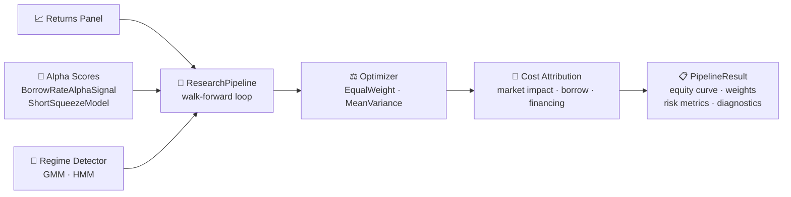
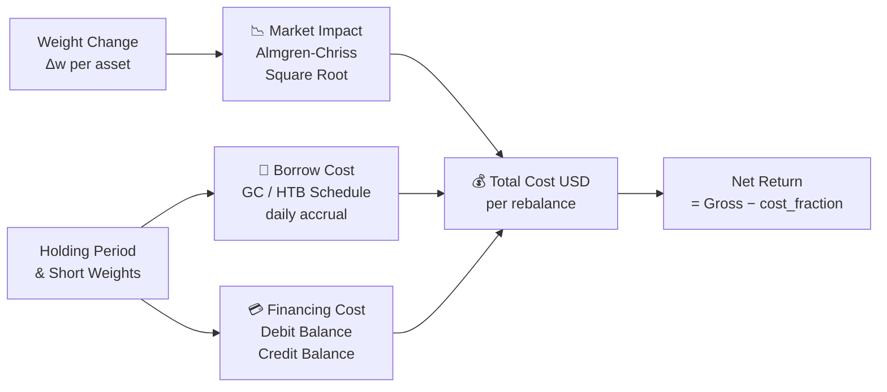

<div align="center">

# 🏛️ QR Haven

### *Institutional-grade quantitative research infrastructure, built from first principles.*

QR Haven is a **production-quality modeling library** for systematic hedge fund research —
real cost models, alpha injection, walk-forward backtesting, and regime detection
engineered the way a quant desk actually builds them.

<br/>

[](pyproject.toml)
[](tests/)
[]()
[]()
[]()

<br/>

**[Vision](#-vision)** ·
**[What's Built](#-whats-built)** ·
**[Architecture](#-architecture)** ·
**[Quick Start](#-quick-start)** ·
**[Repository Structure](#️-repository-structure)** ·
**[Roadmap](#-roadmap)**

</div>

---

## 🎯 Vision

> [!NOTE]
> This repository is not another collection of finance notebooks. It demonstrates the
> ability to build **institutional-grade quantitative research infrastructure** —
> the kind that exists at Citadel, Point72 Cubist, Millennium, AQR, and Two Sigma.

Every module answers one question:

> *"Would a systematic hedge fund trust me to build, research, and productionize portfolio management systems?"*

QR Haven emphasizes:

| Pillar | What it means in practice |
| --- | --- |
| 🔬 **Research methodology** | Walk-forward validation, point-in-time safety, no lookahead |
| 💸 **Real transaction costs** | Almgren-Chriss, square-root impact, borrow cost, financing cost |
| 📊 **Alpha attribution** | Pre-computed alpha panels injected into the pipeline at rebalance time |
| 🎰 **Regime awareness** | GMM + HMM detectors condition position sizing and allocation |
| 🏦 **Securities finance** | Short squeeze risk, borrow rate alpha — first-class, not an afterthought |
| ⚙️ **Software engineering** | Type hints, dataclasses, 544 passing tests, installable package |

---

## ✅ What's Built

> [!TIP]
> The library is installable: `pip install -e .` from the repo root. Every module
> below ships with a full test suite and typed public API.

### Core Infrastructure

| Module | What's implemented | Tests |
| --- | --- | --- |
| `costs/market_impact` | `SquareRootImpactModel`, `AlmgrenChrissModel` — trade size → cost in bps | ✅ |
| `costs/borrow` | `BorrowCostModel`, `BorrowCostSchedule` — GC / HTB fee schedules, daily accrual | ✅ |
| `costs/financing` | `FinancingCostModel`, `FinancingRates` — debit/credit balance, prime broker spread | ✅ |
| `costs/squeeze` | `ShortSqueezeModel` — cross-sectional z-score composite, tiered risk (LOW/MOD/HIGH) | ✅ |
| `alpha/borrow_signal` | `BorrowRateAlphaSignal` — momentum & contrarian modes, panel computation | ✅ |
| `regimes/gmm` | `GMMRegimeDetector` — EM in log-space, probabilistic regime labels | ✅ |
| `regimes/hmm` | `GaussianHMMDetector` — Baum-Welch + Viterbi, numpy-only, no HMM libraries | ✅ |
| `portfolio/optimizers` | `EqualWeightOptimizer`, `MeanVarianceOptimizer`, `OptimizerConstraints` | ✅ |
| `research/pipeline` | `ResearchPipeline` — end-to-end alpha → optimize → backtest with cost attribution | ✅ |
| `features/securities_lending` | Borrow utilization, cost-of-carry, rebate rate, lending revenue features | ✅ |
| `backtesting` | Walk-forward engine, performance attribution, equity curve construction | ✅ |
| `risk` | VaR, CVaR, drawdown, factor risk decomposition | ✅ |
| `reporting` | Performance attribution reports, diagnostic DataFrames | ✅ |

### Pipeline Output

`ResearchPipeline.run()` returns a fully attributed `PipelineResult`:

| Field | Type | What it contains |
| --- | --- | --- |
| `portfolio_returns` | `pd.Series` | Net-of-cost daily returns |
| `gross_portfolio_returns` | `pd.Series` | Pre-cost returns |
| `equity_curve` | `pd.Series` | Cumulative wealth, normalized to 1.0 |
| `weights` | `pd.DataFrame` | Rebalance-date weight matrix |
| `costs` | `CostBreakdown` | Per-rebalance market impact · borrow · financing (USD) |
| `turnover` | `pd.Series` | One-way turnover per rebalance |
| `asset_contributions` | `pd.DataFrame` | Per-asset return attribution |
| `risk_metrics` | `dict` | Sharpe, Sortino, max drawdown, annualized vol |
| `alpha_scores_used` | `pd.DataFrame \| None` | Sliced alpha panel that drove each rebalance |

---

## 🏗️ Architecture

The end-to-end research pipeline:



> [!IMPORTANT]
> All alpha lookups are **as-of-date safe** — only scores with an index
> `<= rebalance_date` are visible, eliminating forward-looking bias.

### Cost attribution detail



---

## 🚀 Quick Start

```sh
git clone https://github.com/joshualutkemuller/QR-Haven.git
cd QR-Haven
pip install -e ".[dev]"
pytest tests/ -q
```

### Run the ResearchPipeline

```python
import pandas as pd
from qr_haven.costs.market_impact import SquareRootImpactModel
from qr_haven.costs.borrow import BorrowCostSchedule
from qr_haven.costs.financing import FinancingRates
from qr_haven.portfolio import EqualWeightOptimizer
from qr_haven.research import ResearchPipeline, PipelineConfig

# Configure
config = PipelineConfig(
    lookback_periods=60,   # rolling estimation window
    rebalance_periods=21,  # monthly rebalancing
    nav=10_000_000.0,      # $10M portfolio
)

# Wire cost models
pipeline = ResearchPipeline(
    optimizer=EqualWeightOptimizer(),
    borrow_schedule=BorrowCostSchedule.gc_schedule(assets),
    financing_rates=FinancingRates(debit_rate=0.055, credit_rate=0.04),
    impact_model=SquareRootImpactModel(eta=0.1),
    config=config,
)

# Run with optional alpha signal injection
result = pipeline.run(returns, alpha_scores=alpha_panel, adv_usd=adv_series)

print(result.summary())
# {
#   "total_return": 0.142,
#   "gross_total_return": 0.159,
#   "sharpe_ratio": 1.23,
#   "cost_drag": -0.017,
#   "alpha_model_used": True,
#   "observations": 140,
#   ...
# }
```

### Build a borrow rate alpha signal

```python
from qr_haven.alpha import BorrowRateAlphaSignal

signal = BorrowRateAlphaSignal(direction="momentum")  # or "contrarian"
alpha_panel = signal.compute_panel(borrow_rate_panel)  # dates × assets
```

### Score short squeeze risk

```python
from qr_haven.costs import ShortSqueezeModel

model = ShortSqueezeModel()
scores = model.score(universe_df)   # DataFrame with borrow/lending metrics per asset
# scores.squeeze_tier: "LOW" / "MODERATE" / "HIGH" per ticker
```

### Detect market regimes

```python
from qr_haven.regimes import GaussianHMMDetector

hmm = GaussianHMMDetector(n_states=3, n_iter=200)
hmm.fit(macro_factor_returns)
states = hmm.predict(macro_factor_returns)           # Viterbi path
proba  = hmm.predict_proba(macro_factor_returns)     # smoothed posteriors
```

---

## 🗂️ Repository Structure

```text
QR-Haven/
├── 📄 README.md
├── 📦 pyproject.toml
├── 🧪 tests/                         # 544 passing tests
│   ├── test_research_pipeline.py     # 47 tests — full pipeline
│   ├── test_regime_detection.py      # 62 tests — GMM + HMM
│   ├── test_short_squeeze.py         # 33 tests — squeeze risk model
│   ├── test_borrow_signal.py         # 33 tests — borrow rate alpha
│   ├── test_market_impact.py         # Almgren-Chriss + square root
│   ├── test_borrow_cost.py           # GC / HTB schedule accrual
│   ├── test_financing_cost.py        # debit / credit balance math
│   └── ...
├── 🐍 src/qr_haven/
│   ├── 💸 costs/                     # transaction cost models
│   │   ├── market_impact.py          # Almgren-Chriss, Square Root
│   │   ├── borrow.py                 # BorrowCostModel, schedules
│   │   ├── financing.py              # FinancingCostModel, rates
│   │   └── squeeze.py                # ShortSqueezeModel ← securities finance
│   ├── 🧠 alpha/                     # signal generation
│   │   ├── borrow_signal.py          # BorrowRateAlphaSignal
│   │   └── models.py                 # CompositeAlphaModel
│   ├── 🎰 regimes/                   # regime detection
│   │   ├── gmm.py                    # GMMRegimeDetector (EM, log-space)
│   │   ├── hmm.py                    # GaussianHMMDetector (Baum-Welch)
│   │   └── _math.py                  # logsumexp, log_mvn, k-means init
│   ├── ⚖️ portfolio/                 # construction & optimization
│   │   └── optimizers.py             # EqualWeight, MeanVariance, constraints
│   ├── 🔬 research/                  # end-to-end research pipeline
│   │   └── pipeline.py               # ResearchPipeline, PipelineResult
│   ├── 📊 features/                  # feature engineering
│   │   └── securities_lending.py     # borrow utilization, rebate rate, etc.
│   ├── 📉 risk/                      # risk engine
│   ├── 🗃️ backtesting/              # walk-forward framework
│   ├── 📋 reporting/                 # attribution & performance reports
│   ├── 🤖 ml/                        # ← next: LSTM forecaster, autoencoders
│   ├── 📐 options/                   # ← next: vol surface, Greeks
│   ├── 🎯 fixed_income/              # ← next: Nelson-Siegel, Svensson
│   ├── ⚡ execution/                 # ← next: VWAP, TWAP, IS
│   ├── 🌐 ai_agents/                 # ← next: research, RAG, NLP agents
│   └── 🔌 integrations/
│       └── market_terminal/          # Bloomberg-like terminal plugin surface
├── 📓 notebooks/
├── 🔧 configs/
└── 📚 docs/
```

<details>
<summary><b>Module completion status</b></summary>

<br/>

| Package | Status | Notes |
| --- | --- | --- |
| `costs/` | ✅ Complete | 4 models, 3 test files |
| `alpha/` | ✅ Complete | BorrowRateAlphaSignal + CompositeAlphaModel |
| `regimes/` | ✅ Complete | GMM + HMM, numpy-only, full Baum-Welch |
| `portfolio/` | ✅ Complete | EqualWeight + MeanVariance + constraints |
| `research/` | ✅ Complete | ResearchPipeline with full cost attribution |
| `features/` | ✅ Complete | Securities lending feature library |
| `backtesting/` | ✅ Complete | Walk-forward engine |
| `risk/` | ✅ Complete | VaR, CVaR, drawdown, factor decomposition |
| `reporting/` | ✅ Complete | Attribution reports |
| `ml/` | 🔜 Planned | LSTM forecaster, autoencoders, transformers |
| `execution/` | 🔜 Planned | VWAP, TWAP, IS, smart order routing |
| `options/` | 🔜 Planned | Vol surface, SABR/Heston, Greeks |
| `fixed_income/` | 🔜 Planned | Nelson-Siegel, Svensson, carry & roll |
| `ai_agents/` | 🔜 Planned | Earnings NLP, SEC filing RAG, research agent |
| `synthetic_inventory/` | 🔜 Planned | Network-flow optimizer over equity/ETF/futures/TRS/repo replication graph |

</details>

---

## 🗺️ Roadmap

<details>
<summary><b>Next: LSTM Return Forecaster</b></summary>

<br/>

Sequential factor history → next-period cross-sectional return ranks.

- Rolling-window walk-forward training with feature importance via gradient attribution
- Output plugs directly into `ResearchPipeline` as the `alpha_scores` panel
- Ensemble across lookback horizons with IC-weighted blending

</details>

<details>
<summary><b>Next: Execution Simulator</b></summary>

<br/>

Realistic simulation of order execution with microstructure effects.

- VWAP, TWAP, POV (participation-of-volume), Implementation Shortfall
- Realized spread, arrival price, and opportunity cost decomposition
- Plugs into `ResearchPipeline` to replace flat cost models with simulated fills

</details>

<details>
<summary><b>Next: Fixed Income Module</b></summary>

<br/>

Yield curve modeling and bond portfolio construction.

- Nelson-Siegel and Svensson curve fitting
- Carry & roll decomposition, duration/convexity management
- Bond portfolio optimizer with liability-relative constraints

</details>

<details>
<summary><b>Next: Synthetic Inventory Creation Optimizer — 90/100</b></summary>

<br/>

Manufacture economically equivalent short positions when physical inventory is scarce or
prohibitively expensive to borrow.

- Transformation graph over cash equities, ETFs, SSF, options, TRS, and repo
- Cost function: `C(P) = Funding + Margin + Capital + Execution + BasisRisk`
- `P* = argmin C(P)` subject to exposure equivalence — solved as constrained network-flow LP
- Baseline: external borrow at the prevailing HTB rate; synthetic activated only when saving > 5 %
- Advanced: multi-period stochastic replication with CVaR carry constraint

Full spec: [docs/Synthetic-Inventory/README.md](docs/Synthetic-Inventory/README.md)

</details>

<details>
<summary><b>Stretch: ML and AI Research Agents</b></summary>

<br/>

**Neural Networks**
- Autoencoder factor discovery (compressed latent factors as alpha signals)
- Transformer cross-sectional alpha (self-attention over ranked factor scores)
- Reinforcement learning portfolio manager (PPO/SAC with Sharpe reward)

**LLM Signals**
- Earnings transcript sentiment → management tone classifier
- 10-K/10-Q forward guidance extraction → bullishness score
- SEC filing RAG with point-in-time indexing

**Fine-Tuning**
- LoRA fine-tune on earnings corpus (QLoRA for consumer hardware)
- Financial NER: ticker, executive, event classifier

</details>

---

## 🎨 Design Principles

> - **Model realistic costs.** Every backtest runs through real impact, borrow, and financing models — not a flat 5bps.
> - **Point-in-time safe by construction.** Alpha lookups, regime labels, and feature engineering use only information available at the rebalance date.
> - **Composable, not monolithic.** Each cost model, optimizer, and detector is independently testable and wirable into any pipeline.
> - **Securities finance is first-class.** Borrow cost schedules, squeeze risk, and borrow rate alpha are core primitives, not addons.
> - **No look-ahead. No notebook soup.** Research runs as reproducible, typed Python functions — not Jupyter cells with hidden state.

---

## 🧪 Running Tests

```sh
pytest tests/ -v               # full suite (544 tests)
pytest tests/test_research_pipeline.py -v    # pipeline only
pytest tests/test_regime_detection.py  -v   # GMM + HMM only
pytest -k "borrow or squeeze"  -v           # securities finance only
```

---

<div align="center">

<br/>

**Build systematic research infrastructure the way a hedge fund actually uses it.**

*Real costs · Real alpha · Real rigor*

<br/>

*Author: Joshua Lutkemuller · Securities Finance → Hedge Fund Quant Researcher*

</div>
